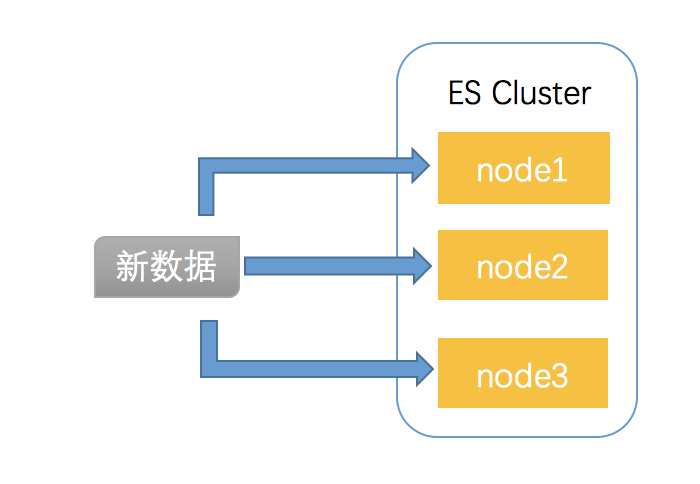

# Elasticsearch集群
* 节点
* 分片和副本
* 故障转移
* 分布式文档

## 节点Node
Elasticsearch集群由许多节点组成，可以通过配置文件`/elasticsearch-6.5.4/config/elasticsearch.yml`中的cluster.name设置集群名称；node.name设置节点名称。
Elasticsearch节点主要有以下4种类型：

* master节点: 用于控制整个集群的操作，比如创建和修改索引，管理其他非master节点等。配置文件`/elasticsearch-6.5.4/config/elasticsearch.yml`中node.master属性设置为true时，该节点可以被选择为master节点。
* data节点: 用于执行数据相关的操作，比如索引的_doc的创建、更新、删除等。配置文件`/elasticsearch-6.5.4/config/elasticsearch.yml`中node.data属性设置为true时，该节点可以被设置为data节点。
* client节点: 用于响应用户的请求，把请求转发的其他节点。配置文件`/elasticsearch-6.5.4/config/elasticsearch.yml`中node.master和node.data均设置为false。
* tribe节点: 当一个节点配置tribe.*时，它是一个特殊的客户端，可以向它发送一个请求，然后它把请求转发到其他的集群上执行搜索等相关操作。


## 分片shard 副本replica
Elasticsearch中的数据是存放在索引index中，但索引index只是一个逻辑名称，真正存储数据的是索引index指向的分片shard。

分片shard是一个最小级别的工作单元，它只保留了索引中所有数据的一部分。它是一个Lucene实例，本身是一个完整的搜索引擎，应用程序不会与其直接通信。<br>

分片分为主分片(primary shard)和副本分片(replica shard)。索引中的每个文档属于一个单独的主分片，主分片的数量决定了最多能存储多少数据。副本分片是主分片的副本备份，用于防止硬件故障导致的数据丢失，同时提供读的请求，比如搜索或者从别的shard取回文档数据。索引创建完成的时候，主分片的数量就固定了，但是副本分片数量可以随时调整。分片的状态会直接影响到索引和集群的监控状态。

## 故障转移
* data节点宕机：当一个data节点宕机之后，其他data节点上的宕机节点的副本分片会被启用，从而保证数据的完整性。当宕机的data节点恢复之后，master节点会将data节点重新纳入集群，重新启用恢复的data节点上的分片。
* master节点宕机：当master节点宕机后，ES集群将会从所有master候选节点中选举得到新的master节点，来确保ES集群的正常状态。

脑裂问题：配置文件`/elasticsearch-6.5.4/config/elasticsearch.yml`中discovery.zen.minimum\_master\_nodes设置如果不是N/2+1时，会出现脑裂问题，先前宕机的master节点恢复后将不会加入到原集群中。

## 分布式文档
### 路由
问题：当一个新数据进入到Elasticsearch集群中，如何确定这个数据被存储到哪一个节点中呢？



在Elasticsearch中，采用以下公式进行计算来确定新的文档数据存储的分片地址：

```
shard = hash(routing) % number_of_primary_shards
```

* routing是一个字符串，默认是\_doc数据的\_id，但是也可以是自定义。
* hash(routing)是对routing进行哈希操作生成一个数字。
* number\_of\_primary\_shards是设置的主分片数量

所以该公式将每一个\_doc数据的\_id进行hash操作得到一个数字，然后对主分片数量进行取模操作，得到的数字就是该\_doc数据应该存放到的分片的编号。同时这个原理也说明了为什么主分片数量不能随便更改，如果主分片数量改变了，那么\_doc数据就找不到存放的分片数了。

### 文档写操作


>1. 客户端给`Node 1`发送新建、索引或删除请求。
>2. 节点使用文档的`_id`确定文档属于分片`0`。它转发请求到`Node 3`，分片`0`位于这个节点上。
>3. `Node 3`在主分片上执行请求，如果成功，它转发请求到相应的位于`Node 1`和`Node 2`的复制节点上。当所有的复制节点报告成功，`Node 3`报告成功到请求的节点，请求的节点再报告给客户端。客户端接收到成功响应的时候，文档的修改已经被应用于主分片和所有的复制分片。你的修改生效了。

### 文档读操作

>1. 客户端给`Node 1`发送`get`请求。
>2. 节点使用文档的`_id`确定文档属于分片`0`。分片`0`对应的复制分片在三个节点上都有。此时，它转发请求到`Node 2`。
>3. `Node 2`返回文档(document)给`Node 1`然后返回给客户端。
>
>对于读请求，为了平衡负载，请求节点会为每个请求选择不同的分片——它会循环所有分片副本。
可能的情况是，一个被索引的文档已经存在于主分片上却还没来得及同步到复制分片上。这时复制分片会报告文档未找到，主分片会成功返回文档。一旦索引请求成功返回给用户，文档则在主分片和复制分片都是可用的。

### 分布式搜索
>一个CRUD操作只处理一个单独的文档。文档的唯一性由`_index`, `_type`和`routing-value（通常默认是该文档的_id）`的组合来确定。这意味着我们可以准确知道集群中的哪个分片持有这个文档。
>如果不知道哪个文档会匹配查询（文档可能存放在集群中的任意分片上），所以搜索需要一个更复杂的模型。一个搜索不得不通过查询每一个我们感兴趣的索引的分片副本，来看是否含有任何匹配的文档。
>但是，找到所有匹配的文档只完成了这件事的一半。在搜索（search）API返回一页结果前，来自多个分片的结果必须被组合放到一个有序列表中。因此，搜索的执行过程分两个阶段，称为查询然后取回（query then fetch）。

* Query查询阶段
	
	
	> 查询阶段包含以下三步：
	>
	> 1. 客户端发送一个search（搜索）请求给`Node 3`,`Node 3`创建了一个长度为from+size的空优先级队列。<br>
	> 2. `Node 3` 转发这个搜索请求到索引中每个分片的原本或副本。每个分片在本地执行这个查询并且结果将结果到一个大小为from+size的有序本地优先队列里去。<br>
	> 3. 每个分片返回document的ID和它优先队列里的所有document的排序值给协调节点`Node 3`。`Node 3`把这些值合并到自己的优先队列里产生全局排序结果。
	>
	> 整个过程类似于归并排序算法，先分组排序再归并到一起，对于这种分布式场景非常适用。
	
* Fetch取回阶段
	
	
	>分发阶段由以下步骤构成：
	>
	>1. 协调节点辨别出哪个document需要取回，并且向相关分片发出`GET`请求。
	>2. 每个分片加载document并且根据需要丰富（enrich）它们，然后再将document返回协调节点。
	>3. 一旦所有的document都被取回，协调节点会将结果返回给客户端。
	>
	>协调节点先决定哪些document是实际（actually）需要取回的。例如，我们指定查询`{ "from": 90, "size": 10 }`，那么前90条将会被丢弃，只有之后的10条会需要取回。这些document可能来自与原始查询请求相关的某个、某些或者全部分片。<br>